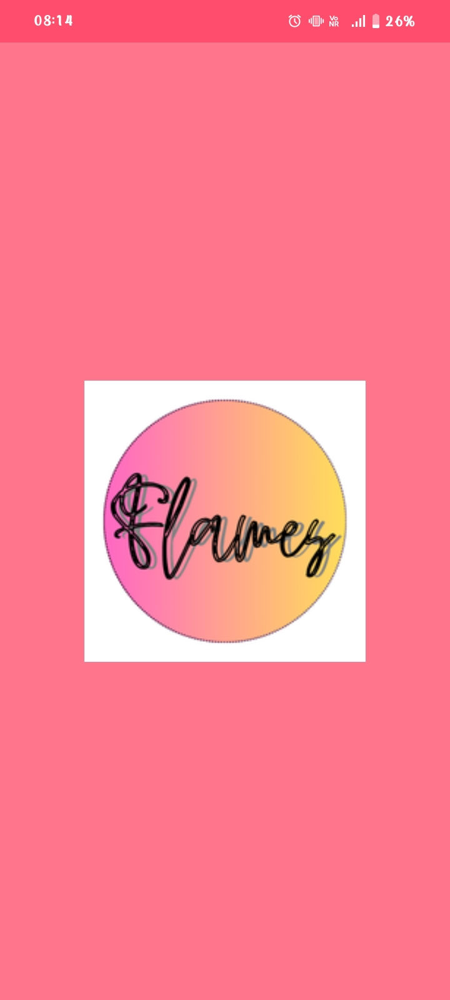
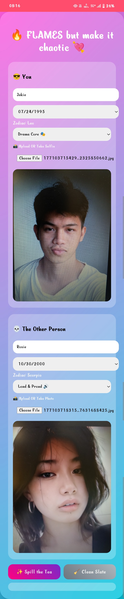
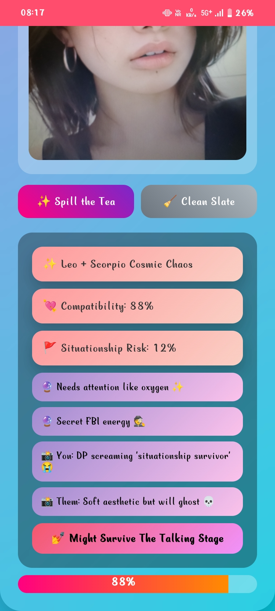

<p align="center">
  
</p>

# 🔥 FLAMES but Make It Chaotic 💘
## Basic Details
### Team Member
- Maidhily S - LBS Institute of Technology for Women

### Hosted Project Link
[[FLAMES Matchmaking APP]](https://maidhily-s.github.io/flames-matchmaker-guru/)

### Project Description
FLAMES but Make It Chaotic is a fun Gen-Z themed matchmaking Progressive Web App that analyzes compatibility using zodiac signs derived from date of birth, personality traits, and uploaded selfies. The app calculates compatibility percentage and situationship risk while delivering humorous meme-style roasts based on personality and vibe analysis.

### The Problem statement
Traditional compatibility apps are either too serious or completely random. There is a lack of interactive, engaging, and relatable tools that blend fun, personality, and realism into matchmaking experiences for younger audiences.

### The Solution
Our app combines astrology logic, personality alignment, age-gap realism, and selfie-based vibe analysis to generate compatibility scores along with entertaining roast-style outputs. It transforms the classic FLAMES game into a modern interactive matchmaking experience.

---

## Technical Details

### Technologies Used

**For Software:**
- Languages used: HTML, CSS, JavaScript
- Frameworks used: None (Vanilla Web App)
- Libraries used: FileReader API
- Tools used: VS Code, Git, GitHub

---

## Features

- Zodiac compatibility derived from DOB
- Personality-based matching
- Selfie upload or live capture
- Compatibility % + Situationship Risk %
- Meme-style roast system
- Installable PWA experience

---

## Implementation

### For Software:

#### Installation
No installation required
```bash
git clone https://github.com/yourusername/flames-app.git
```

#### Run
Open the project:
```bash
Open index.html in browser```
```
## Project Documentation

### For Software:

#### Screenshots (Add at least 3)


*This is the logo that i have designed for my app*


*This is the interface after filling the data as Name,DOB,Personality,Photo*


*The result shown in the interface after executing the result, it shows star signs,compatability,situationship risk, few comments on the star sign and comments on photo uploaded.*

#### Diagrams

**System Architecture:**

The system takes user inputs including DOB, personality, and uploaded image. Zodiac signs are derived from DOB and processed using a compatibility matrix. Personality and photo vibe scoring are combined with zodiac compatibility and age-gap realism to generate a final compatibility score and situationship risk percentage.

**Application Workflow:**


*The given workflow explains how the app is working and its working flow*

## Project Demo

### Video
[Working video](https://drive.google.com/file/d/1LCVrFosFr86DFSwasrQd47SMw88q7Hxk/view?usp=drive_link)
*This video shows how the app works and how the result are shown*
---

## AI Tools Used

**Tool Used:** ChatGPT

**Purpose:** 
- UI improvement
- Compatibility logic design
- Debugging
- PWA guidance


**Percentage of AI-generated code:** ~30%

**Human Contributions:**
- Concept design
- Logic decisions
- Feature selection
- UI theme direction

---

## License

This project is licensed under the MIT License 

---

Made with ❤️ at TinkerHub
